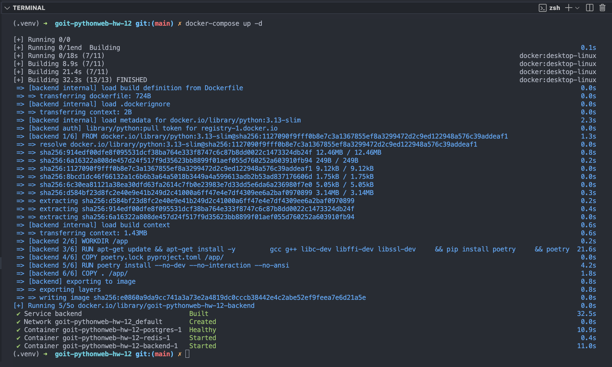
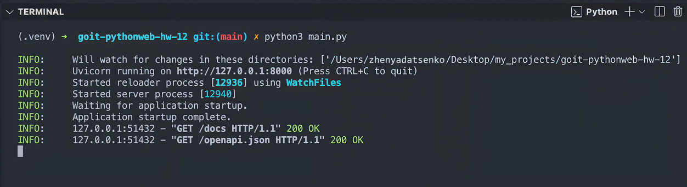
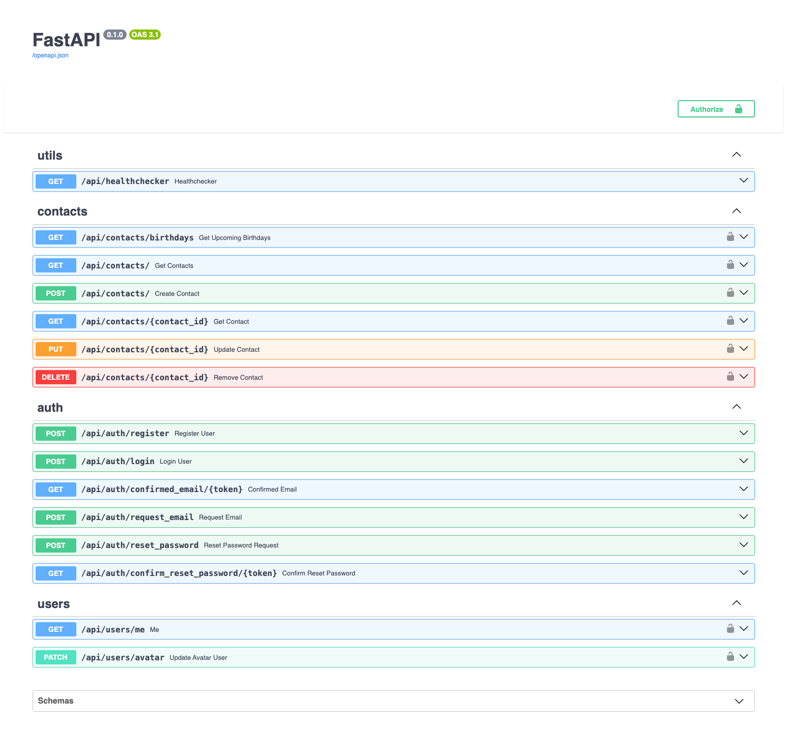
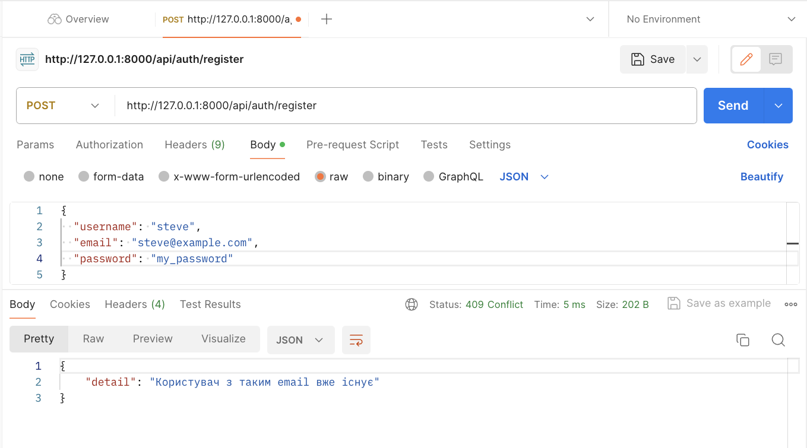

# REST API Application - Enhanced Features

This project builds upon the previous REST API application, adding essential features for security, user management, and data handling.

## Key Features

- **Authentication:** Implemented user authentication with secure password hashing.
- **Authorization (JWT):** JWT-based authorization to protect contact operations, ensuring only registered users can access them.
- **User-Specific Data:** Contacts are associated with users, guaranteeing users can only access their own data.
- **Email Verification:** Registration includes email verification to ensure valid user accounts.
- **Rate Limiting:** Implemented rate limiting for the `/me` user route to prevent abuse.
- **CORS Enabled:** Cross-Origin Resource Sharing (CORS) enabled for secure access from different domains.
- **Avatar Upload:** Users can update their profile avatar using Cloudinary for image storage and management.

## Technical Details

- **Authentication:**
  - Uses password hashing (e.g., bcrypt) for secure storage.
  - Returns HTTP 409 Conflict for duplicate email registrations.
  - Returns HTTP 201 Created on successful registration.
  - Returns HTTP 401 Unauthorized for invalid login credentials.
- **Authorization:**
  - Uses JWT access tokens for secure API access.
  - Access token passed in the `Authorization` header as `Bearer <token>`.
- **Data Access:**
  - Contact creation stores the `user_id` to associate contacts with users.
  - API endpoints verify the `user_id` from the JWT to ensure users only access their own contacts.
- **Email Verification:**
  - Generates a unique token upon registration and sends a verification email.
  - Verifies the token when the user clicks the link, marking the account as verified.
- **Rate Limiting:**
  - Limits requests to the `/me` route to prevent abuse (e.g., 5 requests per minute).
- **CORS:**
  - Configured to allow requests from specific origins (domains).
- **Avatar Upload:**
  - Integrates with Cloudinary to upload and store user avatars.
  - Saves the Cloudinary URL in the user profile.

## General Requirements

- **.env File:** All sensitive information (API keys, database credentials, etc.) is stored in a `.env` file.
- **Docker Compose:** All services (API, database) are orchestrated using Docker Compose for easy setup and deployment.
- **HTTP Status Codes:** Correct HTTP status codes are used for various scenarios (e.g., 200, 201, 400, 401, 409).

## Results

